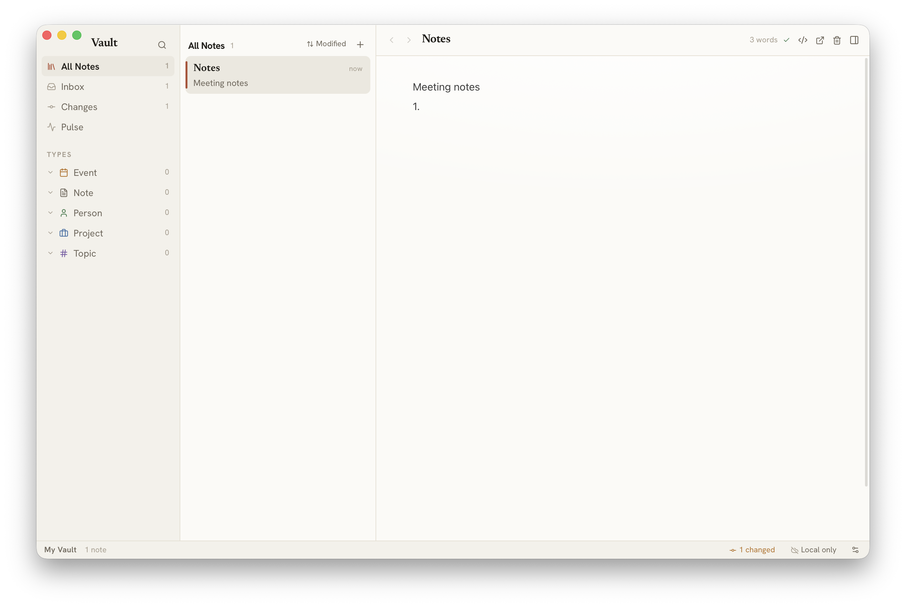

# Vault

> One vault, one window. A local-first personal knowledge base built on plain Markdown and git.

[](LICENSE)
[](#getting-started)
[](https://tauri.app)
[](https://react.dev)



Vault is an open-source personal knowledge management (PKM) desktop app in the
spirit of Obsidian and Bear — without the proprietary lock-in. Every note is a
plain `.md` file with optional YAML frontmatter, every vault is a git
repository, and the app works completely offline. Your notes outlive the app:
they work with any editor, with Pandoc, Hugo, Jekyll, Quartz, or just `grep`.

## Philosophy

| Principle | What it means |
| --- | --- |
| **Files first** | Notes are plain `.md` files on disk. The app never owns your data. |
| **Git first** | Every vault is a git repo. History, blame and sync are native. |
| **Offline first** | No accounts, no servers, no subscriptions. 100% functional offline. |
| **Single vault** | One focused workspace. Open the app — your notes are there. |
| **Keyboard first** | Command palette, wikilink completion, full shortcut map. |
| **Standards based** | Markdown + YAML frontmatter. Interoperable with everything. |
| **Open source** | AGPL-3.0. No feature paywalls. |

## Features

- **Onboarding** — create a blank vault, a getting-started vault with example
  notes and types, or open any existing folder of Markdown. New vaults are
  git-initialized automatically.
- **Four-panel layout** — sidebar · note list · editor · inspector, all
  resizable. Inspired by Bear and [Tolaria](https://github.com/refactoringhq/tolaria).
- **Rich text editor** — block-based editing
  ([BlockNote](https://www.blocknotejs.org)) with headings, lists, to-dos,
  code blocks, quotes, tables and images, fully Markdown-compatible.
- **Wikilinks** — type `[[` for autocomplete, hover a link for a preview,
  click a missing link to create the note. Links round-trip to plain
  `[[Title]]` syntax on disk.
- **Raw Markdown mode** — toggle to CodeMirror 6 with syntax highlighting
  (⌘E); your preference persists.
- **Note types** — a note with `type: type` defines a type (icon, color);
  notes tagged with that type group in the sidebar. Types are lenses, not
  schemas — no required fields, ever.
- **Inspector** — editable frontmatter properties, outgoing relations,
  backlinks, per-file git history with inline diffs, and an instances list
  for type notes.
- **Search** — full-text keyword search across the vault with title-match
  ranking and contextual snippets (⌘F).
- **Command palette & quick open** — every app action searchable (⌘K), jump
  to any note (⌘P).
- **AutoGit** — after a configurable idle period your changes are committed
  as “Updated N note(s)”. Manual commits with custom messages via ⌘⇧G.
- **Sync, your way** — add any git remote (GitHub, GitLab, Gitea,
  self-hosted). Vault pulls with rebase + autostash, pushes, and shows sync
  state in the status bar. No proprietary sync server, ever.
- **Pulse** — a chronological, day-grouped feed of your vault’s git activity.
- **Multi-window** — open notes in focused editor-only windows
  (⌘⇧O or ⌘⇧-click).
- **Auto-save** — debounced 500 ms save-on-change; notes are never lost on
  quit.

## The note format

```markdown
---
title: Build a Second Brain
type: project
status: active
tags:
  - pkm
belongs_to: "[[Areas of Life]]"
related_to:
  - "[[Knowledge Management]]"
---

An example note. Link anything with [[wikilinks]].
```

All frontmatter is optional. The fields Vault understands:

| Field | Purpose |
| --- | --- |
| `title` | Display name (overrides the filename) |
| `type` | Note type — drives sidebar grouping |
| `status` | Lifecycle chip in the note list (`active`, `done`, …) |
| `tags` | Free-form tags |
| `url` | External link for the note |
| `belongs_to` | Parent relationship (wikilink) |
| `related_to` | Sibling relationships (array of wikilinks) |
| `has` | Child relationships (array of wikilinks) |
| `start_date` / `end_date` | Date range for events |

A vault is just a folder — organize it however you like:

```
my-vault/
  .git/                ← created automatically
  type/                ← type definition notes (project.md, person.md, …)
  Projects/
    Vault App.md
  People/
    Ada Lovelace.md
  Welcome.md           ← notes can live anywhere, including the root
```

## Keyboard shortcuts

| Shortcut | Action | Shortcut | Action |
| --- | --- | --- | --- |
| ⌘K | Command palette | ⌘E | Toggle raw Markdown |
| ⌘P / ⌘O | Quick open | ⌘I | Toggle Inspector |
| ⌘N | New note | ⌘F | Search |
| ⌘S | Flush auto-save | ⌘⇧G | Commit dialog |
| ⌘[ / ⌘] | Back / forward | ⌘⇧O | Note in new window |
| `[[` | Wikilink autocomplete | ⌘, | Settings |

## Getting started

Prebuilt binaries are not published yet — building from source takes about two
minutes:

```sh
# prerequisites: Rust (stable), Node 20+, pnpm, git
git clone https://github.com/light-saber/vault.git
cd vault
pnpm install
pnpm tauri dev        # run in development
pnpm tauri build      # build a release .app / .dmg
```

App settings persist at `~/.config/com.vault.app/settings.json`. Deleting that
file returns the app to onboarding (your notes are untouched).

### Syncing between machines

```sh
cd /path/to/your-vault
git remote add origin git@github.com:you/my-vault.git
```

That’s it — Vault picks up the remote, auto-syncs on an interval you control,
and surfaces conflicts in the status bar.

## Architecture

| Layer | Technology |
| --- | --- |
| Desktop shell | [Tauri 2](https://tauri.app) (Rust backend + system WebView) |
| Frontend | React 19 + TypeScript + Vite + Tailwind CSS 4 |
| Rich text | [BlockNote](https://www.blocknotejs.org) with a custom wikilink inline-content spec |
| Raw editor | [CodeMirror 6](https://codemirror.net) |
| State | Zustand |
| Frontmatter | [gray_matter](https://crates.io/crates/gray_matter) (Rust) |
| Search | walkdir file scan with title-ranked keyword matching (Rust) |
| Git | System git CLI, shelled out from Rust |
| Tests | cargo test (backend, incl. full-lifecycle integration) + Vitest (frontend) |

The filesystem is the single source of truth. Every change writes to disk via
Tauri IPC **first**, then updates React state — if the disk write fails, the
UI never pretends it succeeded. The heavy editor bundles are lazy-loaded, so
the app shell starts fast and only the editor mode you use is in memory.

```sh
pnpm test                    # frontend unit tests
cd src-tauri && cargo test   # backend tests
```

## Roadmap

- **v0.x** — conflict-resolution UI, neighborhood view (link-relationship
  browsing), pinned saved views, in-app update notifications
- **v1.x** — Windows and Linux builds, Playwright E2E suite, code signing
- **v2.0** — MCP server + AI integrations, plugin system, semantic search,
  multi-vault

## Credits & acknowledgements

Vault stands on the shoulders of some excellent prior art and tools:

- **[Obsidian](https://obsidian.md)** — wikilinks, the knowledge-graph
  philosophy, and the local-first ethos that inspired this project
- **[Tolaria](https://github.com/refactoringhq/tolaria)** — the files-first,
  git-first architecture, four-panel layout and single-vault model
- **[Bear](https://bear.app)** — layout and typography inspiration
- **[Roam Research](https://roamresearch.com)** and
  **[Logseq](https://logseq.com)** — bidirectional linking ideas
- **[BlockNote](https://www.blocknotejs.org)** — the block-based rich text
  editor
- **[Tauri](https://tauri.app)**, **[CodeMirror](https://codemirror.net)**,
  **[Lucide](https://lucide.dev)** icons, and the
  [Newsreader](https://fonts.google.com/specimen/Newsreader),
  [Hanken Grotesk](https://fonts.google.com/specimen/Hanken+Grotesk) and
  [JetBrains Mono](https://www.jetbrains.com/lp/mono/) typefaces
- Product design: **Sachin** (PRD author) · Built with
  [Claude Code](https://claude.com/claude-code)

## License

[AGPL-3.0](LICENSE) — free forever, no feature paywalls. If you distribute a
modified version (including as a network service), you must share your changes
under the same license.
